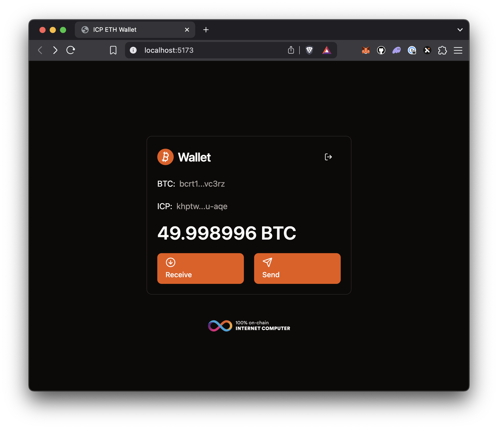

# A multiuser Bitcoin wallet built on the Internet Computer (ICP)

This multiuser Bitcoin wallet allows the user to generate a Bitcoin
address by logging in with their Internet Identity. The user can then send and receive Bitcoin to other users.

The backend canister uses the [ICP Bitcoin API](https://internetcomputer.org/docs/build-on-btc/) to interact with the Bitcoin blockchain.

The frontend is built with React and Vite.

> [!TIP]
> Use this repository as a starting point for building your own multiuser Bitcoin wallet on the Internet Computer.

[![Contributors][contributors-shield]][contributors-url]
[![Forks][forks-shield]][forks-url]
[![Stargazers][stars-shield]][stars-url]
[![Issues][issues-shield]][issues-url]
[![MIT License][license-shield]](LICENSE)


## Try it!

ICP Ninja is a browser IDE for creating Internet Computer (ICP) smart contracts. Write and deploy entire applications directly onchain from the browser. Deploy this example in less than a minute:

[](https://icp.ninja/i?g=https://github.com/kristoferlund/bitcoin_wallet/tree/ninja)

You can also try two predeployed versions of the wallet:

Mainnet: <https://unenw-dyaaa-aaaac-a3e6a-cai.icp0.io>

Testnet: <https://mcejh-aqaaa-aaaan-qz4la-cai.icp0.io>



## Project notes

At all times when interacting with canisters on the IC you should consider the
costs involved, and the fact that update calls take 2-3 seconds to complete. To
create a good user experience, this wallet uses a combination of local state and
canister calls to provide a responsive UI.

- The Bitcoin address is stored in local state after the user logs in. Next
  time the user logs in, the address is retrieved from local state.
- The balance of the Bitcoin address is queried from the backend canister that in
  turn queries the ICP Bitcoin API. A more efficient way to query the balance would be to call an external Bitcoin API directly from the frontend.

> [!IMPORTANT]
> This project is not affiliated with or endorsed by the DFINITY Foundation. It has not undergone any formal security review and is intended for educational and experimental purposes only. Do not use this code in production environments.

## Setup, pre-requisites

Setup your Internet Computer developer environment as well as a local Bitcoin testnet.

[https://internetcomputer.org/docs/build-on-btc/btc-dev-env](https://internetcomputer.org/docs/build-on-btc/btc-dev-env)

## Deploying the project

### 1. Start the Internet Computer with Bitcoin support enabled

```bash
dfx start --clean --enable-bitcoin --bitcoin-node 127.0.0.1:18444
```

### 2. Install dependencies

```
pnpm install
```

### 3. Deploy the canisters

```
dfx deploy
```

When asked to select a network, choose `regtest`.

> [!TIP]
> If you get an permissions error when deploying, you might need to set the execute
> bit on the build script.
>
> ```
> chmod +x build.sh
> ```

## Develop

During development, you can run the frontend with hot reloading using Vite.

```bash
pnpm run dev
```

## Before you start testing

> [!IMPORTANT]
> The Bitcoin "coinbase maturity rule" states that in order to spend newly created bitcoin, it has to be at least 100 blocks old.
>
> Before you create any transactions, mine at least 100 blocks and assign yourself the bitcoin rewards.
>
> ```
> bitcoin-cli -conf=$(pwd)/bitcoin.conf generatetoaddress 100 <address>
>```
>
> Also important, the local regtest network does not mine blocks automatically. You will need to mine blocks manually using the `bitcoin-cli` command after any transaction. Use the above command to mine blocks.

## Backend canister methods

### `get_address`

Get the Bitcoin address for the calling principal or for the principal
specified in the call parameters.

Call signature:

```
type AddressResult = variant { Ok : text; Err : text };

get_address : (owner: opt principal) -> (AddressResult);
```

Get the Bitcoin address for the calling principal:

```bash
dfx canister call backend get_address
```

Get the Bitcoin address for a specified principal:

```bash
dfx canister call backend get_address '(opt principal "hkroy-sm7vs-yyjs7-ekppe-qqnwx-hm4zf-n7ybs-titsi-k6e3k-ucuiu-uqe")'
```

### `get_balance`

Returns the bitcoin balance of the address controlled by a principal.

Call signature:

```
type BalanceResult = variant { Ok : nat64; Err : text };

get_balance : (owner: opt principal) -> (BalanceResult);
```

Get the ETH balance for the calling principal:

```bash
dfx canister call backend get_balance
```

Get the ETH balance for a specified principal:

```bash
dfx canister call backend get_balance '(opt principal "hkroy-sm7vs-yyjs7-ekppe-qqnwx-hm4zf-n7ybs-titsi-k6e3k-ucuiu-uqe")'
```

### `send_btc`

Sends ETH from the Bitcoin controlled by the calling principal to any
recipient.

Call signature:

```
type SendResult = variant { Ok : text; Err : text };

send_btc : (destination_address : BitcoinAddress, amount_in_satoshi : Satoshi) -> (SendResult);
```

Send ETH by specifying receiver address and ETH amount (in wei):

```bash
dfx canister call backend send_btc '("bcrt1pvd8yj03ts02lleztzf3em0glwrw7p03lumk4s6jv602ymzgc5jcqf2gsz8", 1000)'
```

## Contributors

<!-- readme: collaborators,contributors -start -->
<table>
	<tbody>
		<tr>
            <td align="center">
                <a href="https://github.com/kristoferlund">
                    
                    <br />
                    <sub><b>Kristofer</b></sub>
                </a>
            </td>
		</tr>
	<tbody>
</table>
<!-- readme: collaborators,contributors -end -->

## License

This project is licensed under the MIT License. See the LICENSE file for more
details.

## Contributing

Contributions are welcome! Please open an issue or submit a pull request if you
have any suggestions or improvements.

[contributors-shield]: https://img.shields.io/github/contributors/kristoferlund/bitcoin_wallet.svg?style=for-the-badge
[contributors-url]: https://github.com/kristoferlund/bitcoin_wallet/graphs/contributors
[forks-shield]: https://img.shields.io/github/forks/kristoferlund/bitcoin_wallet.svg?style=for-the-badge
[forks-url]: https://github.com/kristoferlund/bitcoin_wallet/network/members
[stars-shield]: https://img.shields.io/github/stars/kristoferlund/bitcoin_wallet?style=for-the-badge
[stars-url]: https://github.com/kristoferlund/bitcoin_wallet/stargazers
[issues-shield]: https://img.shields.io/github/issues/kristoferlund/bitcoin_wallet.svg?style=for-the-badge
[issues-url]: https://github.com/kristoferlund/bitcoin_wallet/issues
[license-shield]: https://img.shields.io/github/license/kristoferlund/bitcoin_wallet.svg?style=for-the-badge
[license-url]: https://github.com/kristoferlund/bitcoin_wallet/blob/master/LICENSE.txt
